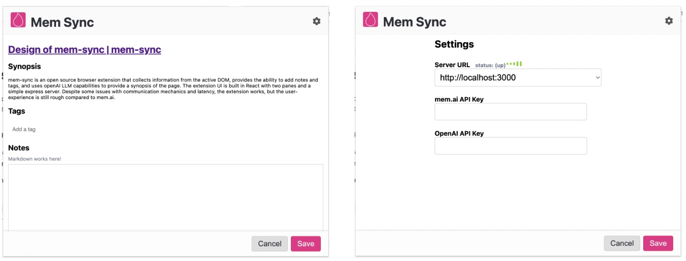
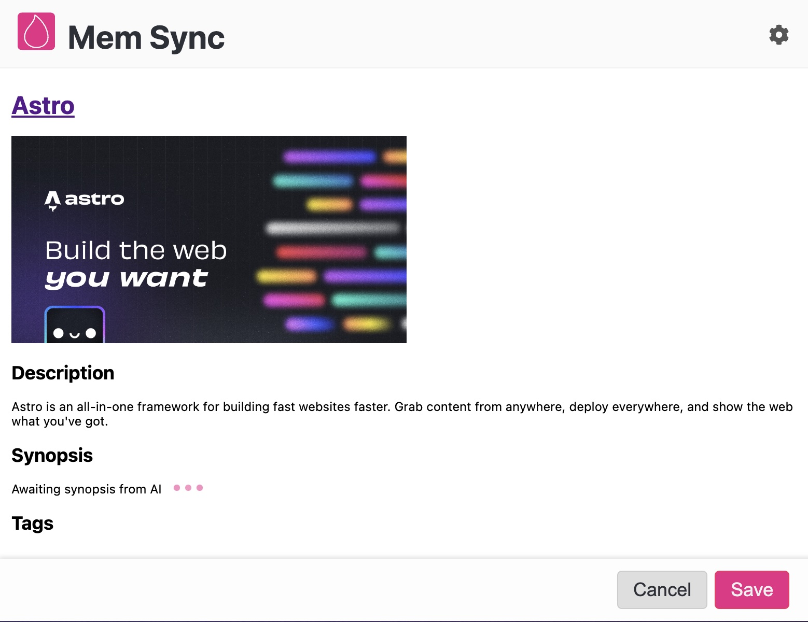

# Design of mem-sync

`mem-sync` is an browser extension that collects some information
from the active DOM (title, image, description), provides the ability
to add notes and tags (mem.ai style #tags in the notes), and uses
the openAI LLM capabilities to provide a synopsis of the page.
This is accomplished via langchain. 

The extension UI itself is built in React - with two panes:
1. the main page information pane
2. a settings pane (allows setting custom API keys)

A simple express server backs this, allowing for 
- saving settings (API keys)
- summarizing the `innerText` of the page in question
- saving a mem once the user is ready. 

## Deliverables
 - [Github Repo](https://github.com/sramam/mem-sync)
 - [Getting started](https://github.com/sramam/mem-sync#readme)
 - [Desing discussion](./) (this document)

## UI Screenshots

### Basic screens

### Site with og:image meta tag

## Information flow
This is a reasonably simple capability:

- DOM data is extracted by the content_script and sent to background.js
- background.js parses this into a partial `pageInfo` object
- this is sent to the popup.html and updates the extension view
- the `innerText` is also sent to the server for openAI summarization and tag extraction. 
- once the summarization information is available, `pageInfo` is updated
- on saving, a mem is created

## Issues
Getting the communication between the various entities to work turned out 
to being the biggest challenge. There are many pitfalls with building 
browser extensions - from lack of great debugging tools, cryptic messages,
undocumented or poorly documented configuration, and timing issues.

Not being familiar with building browser extensions, there were many 
timing issues coupled with easily misconfigured settings that caused
the communication mechanics to be re-designed 3 times!

The LLM latency is still an issue. This version does a few things to try 
and hide it, however significant improvements are possible.

A lingering artifact of the communication mechanics, is that the extension
works, but only for the first page visited on installation. I suspect 
the popup scripts are not re-registering themselves on opening up a second
time. Will be investigating that for a bit more, after this submission. 

While I'd like to say something clever in terms of overcoming this, 
really it was just brute-forcing my way to trying multiple combinations
to find the settings and architecture that worked.

## Stability
The browser extension works, however, the user-experience is rather rough 
- especially compare to what mem.ai provides currently.

The UI has some elegances, but it's probably in the eye-of-the-beholder. 

